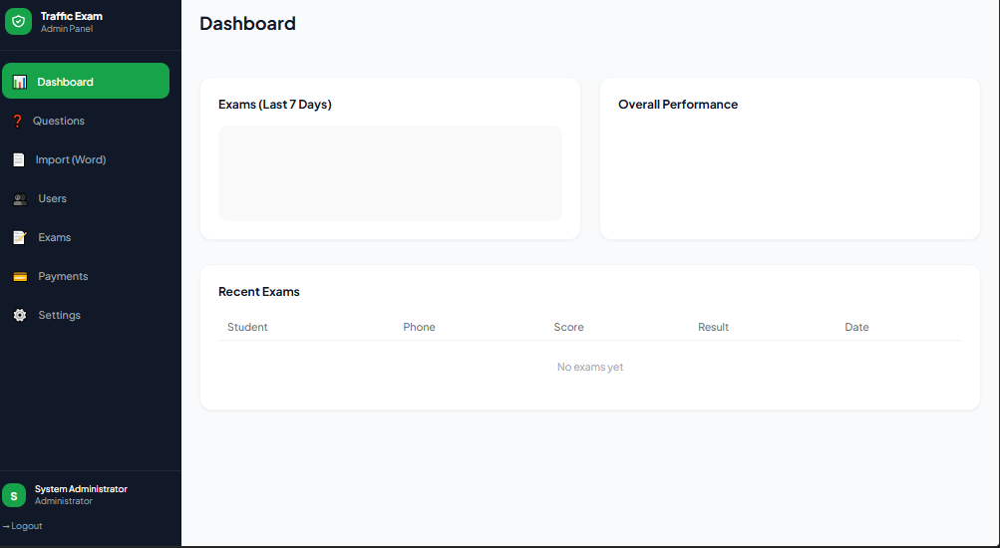
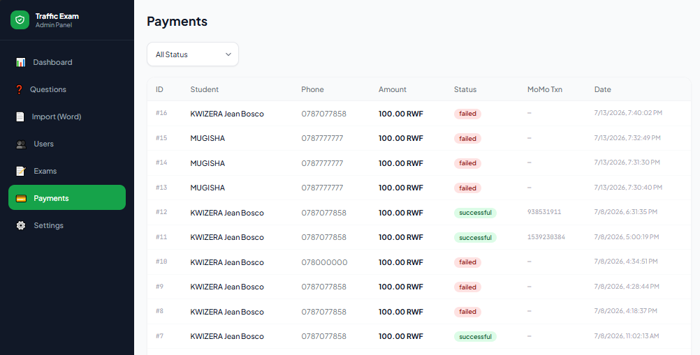
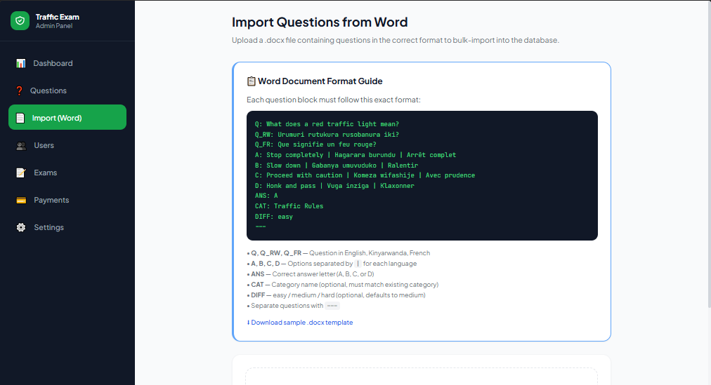
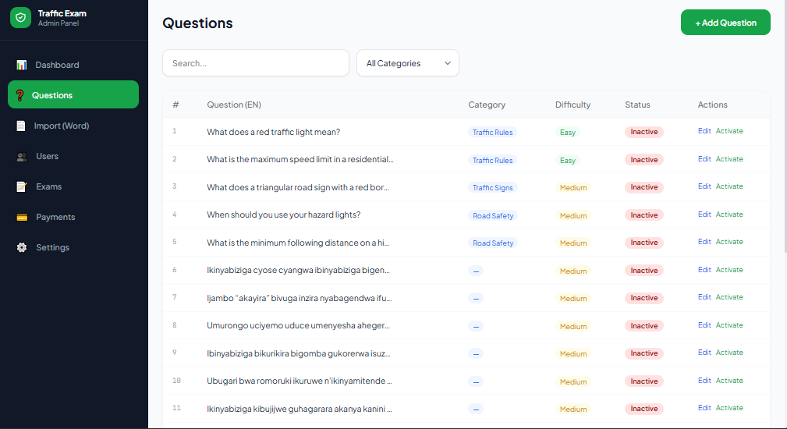
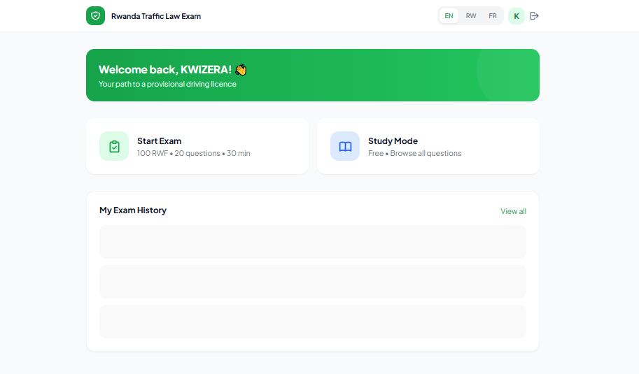
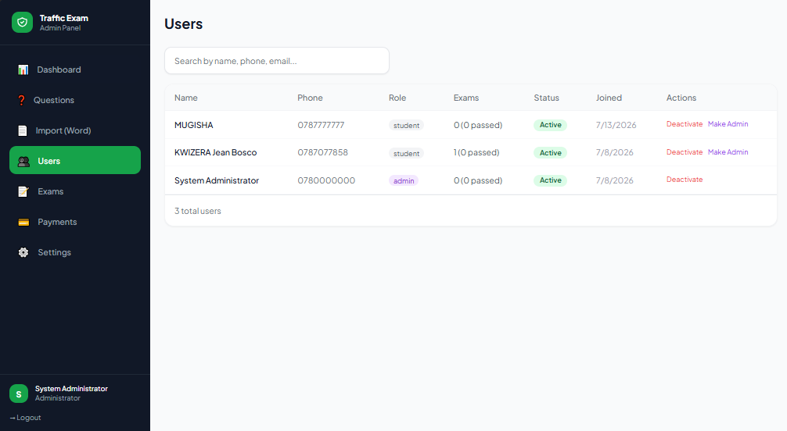
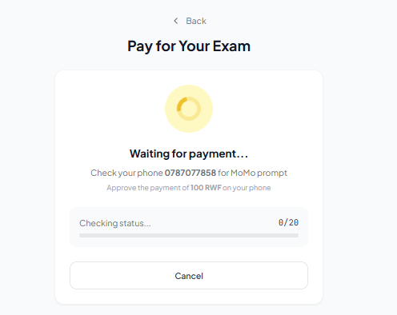

# 🚦 Rwanda Traffic Law Exam System

A full-stack web application for Rwanda traffic law exam preparation and certification.
Built with **Node.js + Express + MySQL** (backend) and **Vue 3 + Vite + TailwindCSS** (frontend).

## Screenshots











## ✨ Features

- 🌐 **Trilingual** — English, Kinyarwanda, French
- 💳 **MTN Mobile Money** payment integration (100 RWF per exam)
- 📝 **20 randomized questions** per exam with 30-minute timer
- ✅ **Pass/Fail tracking** with detailed review of answers
- 📄 **Word (.docx) import** — bulk import questions from formatted Word documents
- 👤 **Student portal** — register, pay, take exams, view history
- 🔐 **Admin panel** — manage questions, users, exams, payments, settings
- 📱 **Responsive** — works on desktop and mobile

---

## 🗂️ Project Structure

```
traffic-law-app/
├── backend/                  # Node.js + Express API
│   ├── server.js
│   ├── .env.example
│   └── src/
│       ├── config/database.js
│       ├── controllers/
│       ├── middleware/
│       ├── routes/
│       ├── services/momoService.js
│       └── utils/docxParser.js
├── frontend/                 # Vue 3 + Vite + TailwindCSS
│   ├── src/
│   │   ├── views/           # All pages
│   │   ├── stores/          # Pinia stores
│   │   ├── router/
│   │   ├── composables/
│   │   ├── locales/         # i18n translations
│   │   └── services/api.js
└── database/
    └── schema.sql           # Full MySQL schema + seed data
```

---

## 🏗️ System Architecture

```
Vue 3 Frontend
       │
       ▼
REST API (Express.js)
       │
       ▼
MySQL Database
       │
       ├── Users
       ├── Questions
       ├── Exams
       ├── Answers
       └── Payments
```

## 🚀 Setup Instructions

### 1. Prerequisites

- Node.js v18+
- MySQL 8.0+
- MTN Developer account (https://momodeveloper.mtn.com)

---

### 2. Database Setup

```bash
mysql -u root -p < database/schema.sql
```

This creates the `traffic_exam_db` database with all tables, sample questions, and a default admin user.

**Default Admin Credentials:**
- Phone: ``
- Password: ``
> ⚠️ Change admin password immediately after first login!

---

### 3. Backend Setup

```bash
cd backend
npm install

# Copy and configure environment
cp .env.example .env
# Edit .env with your MySQL and MoMo credentials
nano .env

# Start development server
npm run dev
```

The API runs on **http://localhost:5000**

---

### 4. Frontend Setup

```bash
cd frontend
npm install
npm run dev
```

The app runs on **http://localhost:5173**

---

### 5. MTN MoMo Setup

1. Register at https://momodeveloper.mtn.com
2. Subscribe to the **Collections** product
3. Get your **Subscription Key**
4. Create an API user and key using the Provisioning API or sandbox tools
5. Add credentials to `.env`:
   ```
   MOMO_COLLECTION_SUBSCRIPTION_KEY=your_key
   MOMO_API_USER_ID=your_user_id
   MOMO_API_KEY=your_api_key
   MOMO_ENVIRONMENT=sandbox   # or production
   ```

> Note: In sandbox mode, the currency is EUR (MoMo sandbox limitation). Switch to `production` for RWF.

---

## 📄 Word Document Format (Question Import)

Format your .docx file with each question block like this:

```
Q: What does a red traffic light mean?
Q_RW: Urumuri rutukura rusobanura iki?
Q_FR: Que signifie un feu rouge?
A: Stop completely | Hagarara burundu | Arrêt complet
B: Slow down | Gabanya umuvuduko | Ralentir
C: Proceed with caution | Komeza wifashije | Avec prudence
D: Honk | Vuga inziga | Klaxonner
ANS: A
CAT: Traffic Rules
DIFF: easy
---
```

**Fields:**
- `Q / Q_RW / Q_FR` — Question in each language
- `A/B/C/D` — Options with `|` separator between EN | RW | FR
- `ANS` — Correct answer letter (A, B, C, or D)
- `CAT` — Category (must match existing category name in English)
- `DIFF` — easy / medium / hard
- Separate questions with `---`

---

## 🔐 API Endpoints

### Public
- `POST /api/auth/register`
- `POST /api/auth/login`
- `GET /api/questions`

### Student (requires JWT)
- `POST /api/payments/initiate`
- `GET /api/payments/:id/status`
- `POST /api/exams/create`
- `GET /api/exams/:id/questions`
- `POST /api/exams/:id/answer`
- `POST /api/exams/:id/finish`
- `GET /api/exams/my-exams`

### Admin (requires admin JWT)
- `GET /api/admin/dashboard`
- `GET|PUT /api/admin/users/:id`
- `GET|POST|PUT|DELETE /api/admin/questions`
- `POST /api/admin/questions/import-docx`
- `GET /api/admin/exams`
- `GET /api/admin/payments`
- `GET|PUT /api/admin/settings`
- `GET|POST /api/admin/categories`

---

## 🚢 Production Deployment

```bash
# Backend
cd backend
npm start

# Frontend - build static files
cd frontend
npm run build
# Serve dist/ with nginx or similar
```

Recommended: Use **nginx** as reverse proxy, **PM2** for Node.js process management, and **Let's Encrypt** for SSL.

---

## 🔒 Security Notes

- Passwords are hashed using bcrypt.
- JWT tokens are required for protected routes.
- Admin endpoints require administrator privileges.
- Payment credentials are stored in environment variables and never committed to source control.

---

## 🚀 Future Improvements

- Real MTN MoMo production integration
- Email and SMS notifications
- Exam analytics and reporting
- AI-assisted question recommendations
- Cloud deployment with Docker and CI/CD

---

## 📞 Support

For MTN MoMo integration issues, refer to:
https://momodeveloper.mtn.com/docs
